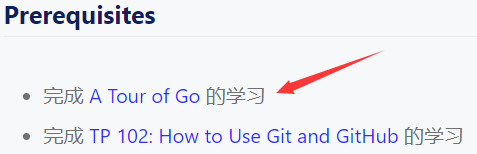

# 学习go

## 缘起

在写A new way to cpp的时候我想用数据库来引入 I/O模型，并发，数据结构的概念。发现我很尴尬的不知道从何起笔。找遍互联网的资料，知乎大佬上来就是大三作业做过数据库，高屋建瓴的说这说那，太不接地气。

恰好此时，我发现了TiDB发起了一个Talent Plan的项目，可以选择学习路线。我就选择了这个项目。

然后发现预备知识有go语言。那么这个是我第一次接触的语言我想知道我一宿能走到哪一步。毕竟我学习过编译原理，也学习了MIT6.001 SICP。想想就兴奋的睡不着觉。

现在是2020/5/1-0:27。反正这次春招也是0 offer，不如学个习放松一下。给大脑来个马杀鸡

## 目录

跟着这个
